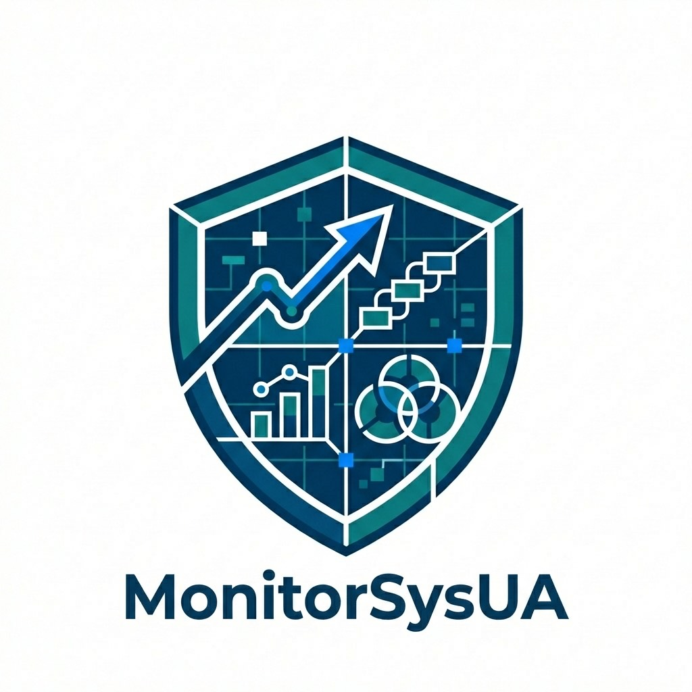

<!-- PROJECT LOGO -->
<br />
<div align="center">
  <a href="https://github.com/ChaoyuWang04/MonitorSysUA">
    
  </a>

<h3 align="center">MonitorSysUA</h3>

<p align="center">
  An internal-oriented full-stack monitoring system for Google Ads operations, AppsFlyer cohort analytics, and evaluation-driven optimization workflows.
  <br /><br />
  | <a href="https://github.com/ChaoyuWang04/MonitorSysUA">Project Repository</a> |
  <a href="https://github.com/ChaoyuWang04/MonitorSysUA/issues/new?labels=bug">Report Bug</a> |
  <a href="https://github.com/ChaoyuWang04/MonitorSysUA/issues/new?labels=enhancement">Request Feature</a> |
</p>

</div>


<!-- ABOUT THE PROJECT -->
## About The Project

MonitorSysUA is a full-stack operations monitoring project built for ad-ops workflows around **Google Ads** and **AppsFlyer**. It combines account-scoped change-event auditing, entity synchronization, cohort-data ingestion, and evaluation logic into a single internal dashboard.

The repository currently focuses on **operator visibility and evaluation feedback loops**:

| Component | Description |
|--------|-------|
| Multi-account management | Manage Google Ads accounts with account-scoped isolation across UI and API |
| Change event auditing | Sync and search Google Ads ChangeEvent history with field-level diffs and bilingual summaries |
| Entity synchronization | Pull campaigns, ad groups, and ads into local tables with latest-change context |
| AppsFlyer cohort platform | Ingest events, retention, installs, cost, and revenue into PostgreSQL |
| Evaluation suite | Calculate baselines, campaign health, and operation scores from AppsFlyer data |
| Recommendations | Surface action recommendations and optimizer leaderboard views in the dashboard |
| Internal dashboard | MUI-based monitoring UI for accounts, events, entities, and evaluation pages |

The current workflow in this repo is:

1. Configure local credentials and infrastructure for PostgreSQL, Google Ads, and AppsFlyer.
2. Register one or more Google Ads accounts in the dashboard.
3. Sync Google Ads change events and full-state entities for the selected account.
4. Sync AppsFlyer cohort and revenue data through Python ETL jobs.
5. Compute baselines, campaign evaluations, and operation scores from the collected data.
6. Review results in the dashboard and use recommendations to guide operator actions.


### Built With

[![Next.js][Nextjs-badge]][Nextjs-url]
[![React][React-badge]][React-url]
[![TypeScript][Typescript-badge]][Typescript-url]
[![tRPC][Trpc-badge]][Trpc-url]
[![PostgreSQL][Postgres-badge]][Postgres-url]
[![MUI][Mui-badge]][Mui-url]


<!-- GETTING STARTED -->
## Getting Started

### Prerequisites

- Node.js and npm
- [Just](https://github.com/casey/just) for task running
- Docker and Docker Compose
- Python 3.12 recommended for Google Ads and AppsFlyer scripts
- Atlas CLI for schema migration workflows
- Google Ads credentials under `local/credentials/google-ads/`
- AppsFlyer API token and related environment variables

Before running the app, copy `.env.example` into your local environment and fill in the required values for:

- `DATABASE_URL`
- `GOOGLE_ADS_*`
- `AF_*`
- `PG_*`
- optional `SMTP_*` variables for sync-failure notifications

### Installation

1. Clone the repo
   ```sh
   git clone https://github.com/ChaoyuWang04/MonitorSysUA.git
   cd MonitorSysUA
   ```

2. Install JavaScript dependencies
   ```sh
   just install
   ```

3. Start PostgreSQL and the AppsFlyer ETL container
   ```sh
   just docker-up
   ```

4. Apply database migrations
   ```sh
   just db-apply
   ```

5. Start the development server
   ```sh
   just dev
   ```

6. Verify the main local services
   ```
   MonitorSysUA/
   ├── app/
   │   └── (dashboard)/accounts/, events/, entities/, evaluation/
   ├── components/
   ├── lib/
   ├── server/
   │   ├── api/
   │   ├── db/
   │   ├── google-ads/
   │   ├── appsflyer/
   │   └── evaluation/
   ├── atlas/
   ├── scripts/
   ├── docs/
   ├── context/
   ├── docker-compose.yml
   ├── justfile
   ├── package.json
   ├── README.md
   └── LICENSE
   ```


<!-- USAGE EXAMPLES -->
## Usage

The current platform can be understood as five stages:

**Stage 1 - Configure local environment and accounts**

Set up `.env`, bring up Docker services, apply migrations, and create or edit Google Ads accounts from the dashboard.

```sh
just install
just docker-up
just db-apply
just dev
```

**Stage 2 - Sync Google Ads change events**

Use the Events page to fetch Google Ads ChangeEvent records for the selected account. The backend loads account context, calls the Python fetcher, deduplicates the result set, and stores searchable audit history in `change_events`.

```sh
just db-regenerate-summaries
```

**Stage 3 - Sync Google Ads entities**

Use the Entities page to synchronize campaigns, ad groups, and ads. The sync process upserts the latest entity state and keeps the dashboard aligned with Google Ads resource data.

```sh
# Entity sync is triggered from the UI for the selected account.
```

**Stage 4 - Sync AppsFlyer data**

AppsFlyer ETL jobs collect event-level revenue data and cohort KPI data into PostgreSQL. Daily sync can run from Docker cron or manually through commands and UI triggers.

```sh
just af-sync-yesterday
```

Optional backfill and database tooling are also available:

```sh
just db-status
just db-studio
just db-snapshot
```

**Stage 5 - Run evaluation and review the dashboard**

After Google Ads and AppsFlyer data are present, the evaluation suite computes baselines, campaign evaluations, and operation scores. Results are exposed in the dashboard under campaigns, creatives, and operations.

```sh
just db-test
```

You can also browse the docs site locally:

```sh
just docs-serve
```


<!-- ROADMAP -->
## Roadmap

- [x] Multi-account Google Ads management and account-scoped data isolation
- [x] Google Ads change-event sync with bilingual summaries and field-level diffs
- [x] Campaign, ad group, and ad full-state synchronization
- [x] AppsFlyer event and cohort KPI ingestion into PostgreSQL
- [x] Baseline, campaign, and operation evaluation based on AppsFlyer data
- [x] Internal dashboard for accounts, events, entities, and evaluation views
- [ ] Replace remaining mock-backed creative evaluation with real AppsFlyer-driven data
- [ ] Add authentication and role-based access control for non-trusted environments
- [ ] Add scheduler/orchestration improvements beyond current manual and cron-triggered flows
- [ ] Improve production-grade observability, backup, and alerting
- [ ] Expand action execution from mock workflows to real execution endpoints

See the [open issues](https://github.com/ChaoyuWang04/MonitorSysUA/issues) for a full list of proposed features and known issues.


<!-- CONTRIBUTING -->
## Contributing

Contributions are welcome through issues and pull requests, especially for documentation, stability improvements, and workflow refinements. That said, this repository is still primarily a personal/internal project, so some roadmap and implementation decisions may remain opinionated or evolve quickly.

If you have a suggestion that would make this better, please fork the repo and create a pull request. You can also open an issue with the tag "enhancement" or "bug".

1. Fork the Project
2. Create your Feature Branch (`git checkout -b feature/AmazingFeature`)
3. Commit your Changes (`git commit -m 'Add some AmazingFeature'`)
4. Push to the Branch (`git push origin feature/AmazingFeature`)
5. Open a Pull Request


### Top contributors:

<a href="https://github.com/ChaoyuWang04/MonitorSysUA/graphs/contributors">
  
</a>

<!-- LICENSE -->
## License

Distributed under the MIT License. See `LICENSE` for more information.


<!-- CONTACT -->
## Contact

Chaoyu Wang - [Linkedin](https://www.linkedin.com/in/samwang04/) - [PersonalWeb](https://chaoyuwang04.github.io/)

Project Link: [https://github.com/ChaoyuWang04/MonitorSysUA](https://github.com/ChaoyuWang04/MonitorSysUA)


<!-- ACKNOWLEDGMENTS -->
## Acknowledgments

* [Next.js](https://nextjs.org/) - full-stack application framework
* [tRPC](https://trpc.io/) - type-safe API layer between frontend and backend
* [Drizzle ORM](https://orm.drizzle.team/) - schema and query layer for PostgreSQL
* [AppsFlyer](https://www.appsflyer.com/) - cohort and revenue data source
* [Google Ads API](https://developers.google.com/google-ads/api) - change events and entity sync source
* [Best-README-Template](https://github.com/othneildrew/Best-README-Template) - README structure


<!-- MARKDOWN LINKS & IMAGES -->
[contributors-shield]: https://img.shields.io/github/contributors/ChaoyuWang04/MonitorSysUA.svg?style=for-the-badge
[contributors-url]: https://github.com/ChaoyuWang04/MonitorSysUA/graphs/contributors
[forks-shield]: https://img.shields.io/github/forks/ChaoyuWang04/MonitorSysUA.svg?style=for-the-badge
[forks-url]: https://github.com/ChaoyuWang04/MonitorSysUA/network/members
[stars-shield]: https://img.shields.io/github/stars/ChaoyuWang04/MonitorSysUA.svg?style=for-the-badge
[stars-url]: https://github.com/ChaoyuWang04/MonitorSysUA/stargazers
[issues-shield]: https://img.shields.io/github/issues/ChaoyuWang04/MonitorSysUA.svg?style=for-the-badge
[issues-url]: https://github.com/ChaoyuWang04/MonitorSysUA/issues
[license-shield]: https://img.shields.io/github/license/ChaoyuWang04/MonitorSysUA.svg?style=for-the-badge
[license-url]: https://github.com/ChaoyuWang04/MonitorSysUA/blob/main/LICENSE
[linkedin-shield]: https://img.shields.io/badge/-LinkedIn-black.svg?style=for-the-badge&logo=linkedin&colorB=555
[linkedin-url]: https://www.linkedin.com/in/samwang04/

[Nextjs-badge]: https://img.shields.io/badge/Next.js-000000?style=for-the-badge&logo=nextdotjs&logoColor=white
[Nextjs-url]: https://nextjs.org/
[React-badge]: https://img.shields.io/badge/React-20232A?style=for-the-badge&logo=react&logoColor=61DAFB
[React-url]: https://react.dev/
[Typescript-badge]: https://img.shields.io/badge/TypeScript-3178C6?style=for-the-badge&logo=typescript&logoColor=white
[Typescript-url]: https://www.typescriptlang.org/
[Trpc-badge]: https://img.shields.io/badge/tRPC-2596BE?style=for-the-badge&logo=trpc&logoColor=white
[Trpc-url]: https://trpc.io/
[Postgres-badge]: https://img.shields.io/badge/PostgreSQL-4169E1?style=for-the-badge&logo=postgresql&logoColor=white
[Postgres-url]: https://www.postgresql.org/
[Mui-badge]: https://img.shields.io/badge/MUI-007FFF?style=for-the-badge&logo=mui&logoColor=white
[Mui-url]: https://mui.com/
