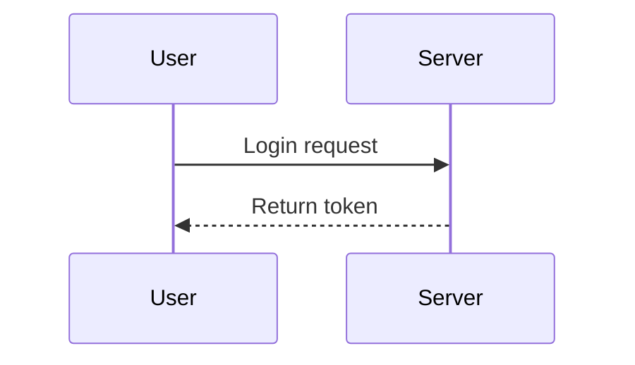

# Docs

MonitorSysUA documentation set for architecture, modules, and system reference.

- Architecture: high-level mermaid map of frontend, backend, and Python services.
- Modules: feature guides for Accounts, Change Events, Evaluation (A2-A5), and AppsFlyer ETL.
- System: stack overviews for frontend, backend, API, database, and repo structure.
- Planning/PRD: product and technical requirements, todos, and design notes.
- Logs: phase log and reviews for each phase.
- API Specs: external + internal (tRPC) OpenAPI files under `docs/api/`.
- Mermaid diagrams: under `docs/Mermaid/` and linked from the sidebar.

View locally with `just docs-serve` (docsify on port 3001).

Mermaid diagrams
- Mermaid is available via docsify-mermaid; diagrams render when browsing the docs site (requires network access to jsDelivr CDN for docsify/mermaid assets).
- Example snippet:

