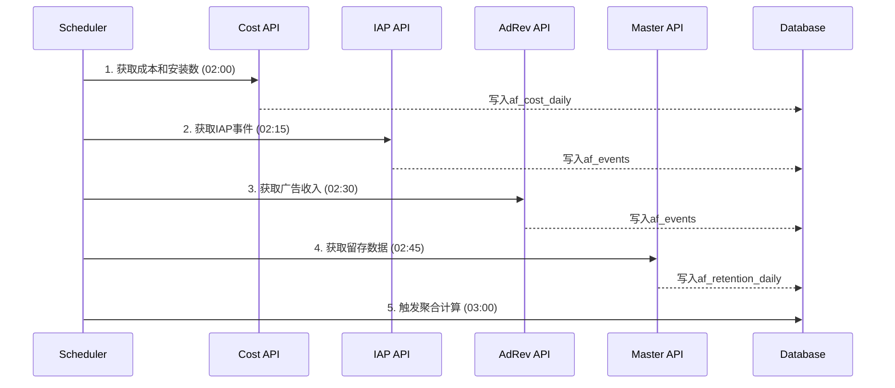

# MonitorSysUA 系统更新 PRD
> Version: 2.0
> Date: 2025-11-24
> Status: MVP Development
> Author: System Architecture Team

## 📋 文档概述

本文档描述了 MonitorSysUA 系统从纯 Google Ads 监控向综合性优化师辅助决策系统的升级方案。通过整合 AppsFlyer 数据，实现基于 Cohort 的用户价值分析和操作效果量化评分。

## 🎯 更新目标

### 1.1 业务目标
- **量化操作效果**：将每次优化师操作转化为可量化的评分，追踪其对 Campaign 表现的实际影响
- **辅助决策**：基于历史数据提供客观的扩量/缩量建议，减少主观判断
- **风险管理**：通过安全线系统和五级风险评估，及时发现和预警异常 Campaign
- **提升 ROI**：通过数据驱动的决策，提升整体广告投放效率

### 1.2 技术目标
- **数据整合**：将 AppsFlyer 的收入、成本、留存数据与现有 Google Ads 变更监控系统整合
- **Cohort 分析**：建立以 install_date 为核心的用户生命周期价值追踪体系
- **自动化处理**：通过 Python 数据管道自动化数据采集、清洗、计算流程
- **可扩展架构**：为未来支持多应用、多渠道、素材级分析预留接口

## 🔄 系统现状与升级范围

### 2.1 现有系统能力
```
已实现功能：
✅ Google Ads 账户管理（MCC 支持）
✅ Campaign 变更实时监控（Change History API）
✅ 变更事件存储和展示
✅ 基础统计面板
✅ Next.js + tRPC + PostgreSQL 技术栈
```

### 2.2 新增功能模块
```
待实现功能：
📊 AppsFlyer 数据集成
   - IAP 收入数据（in_app_events）
   - 广告收入数据（ad_revenue）
   - 成本数据（partners_by_date）
   - 留存数据（Master API）

📈 Cohort 分析引擎
   - D0/D1/D3/D5/D7 收入计算
   - ROAS 和留存率追踪
   - Cohort 成本归属

⚡ 操作评分系统
   - 多阶段评分（T+1/T+3/T+7）
   - 纯结果导向评价
   - 优化师排行榜
   - 特殊表彰机制（大胆创新奖等）

🎯 安全线系统
   - 180 天历史基准
   - 自动月度更新
   - 分层维度管理

💡 智能建议引擎
   - 五级风险评估
   - 扩量/缩量建议
   - Campaign 分层策略
```

## 🏗️ 核心设计原则

### 3.1 数据一致性原则
- **单一数据源**：所有业务数据以 AppsFlyer 为准，确保与 AF 面板数据一致
- **Cohort 主线**：所有分析以 install_date cohort 为唯一主线，确保收入和成本的正确归属
- **时间对齐**：所有时间均使用 UTC，避免时区混乱

### 3.2 评分公平性原则（纯结果导向）
- **结果为王**：评分完全基于ROAS和留存率的实际表现，不考虑操作方式
- **鼓励创新**：如果激进操作带来好结果，给予表彰而非惩罚
- **多维评估**：综合 ROAS 和留存率，避免单一指标偏差
- **激励机制**：设立"大胆创新奖"等特殊表彰，鼓励基于数据的大胆尝试

### 3.3 系统可靠性原则
- **增量更新**：支持数据增量同步，避免全量重复处理
- **错误恢复**：API 调用失败自动重试，数据异常自动标记
- **审计追踪**：所有操作和评分保留完整日志

## 🎨 MVP 范围定义

### 4.1 MVP 包含
- ✅ 单应用支持（solitaire.patience.card.games.klondike.free）
- ✅ Google Ads 渠道（googleadwords_int）
- ✅ Campaign 层级分析
- ✅ 美国市场（geo=US）
- ✅ D0/D3/D5/D7 核心指标
- ✅ 报告生成（手动触发）

### 4.2 MVP 不包含
- ❌ 多应用管理
- ❌ Facebook/TikTok 等其他渠道
- ❌ 素材级分析
- ❌ 自动执行建议
- ❌ 实时数据同步
- ❌ 预测模型（LTV 预测等）

### 4.3 未来扩展预留
- 多应用支持（数据表已预留 app_id）
- 多渠道支持（已预留 media_source）
- 素材级分析（预留 creative_id）
- 规则引擎接口（自动执行）

## 📊 成功指标

### 5.1 系统指标
- 数据同步成功率 > 99%
- API 调用成功率 > 95%
- 数据处理延迟 < 2 小时
- 系统可用性 > 99.5%

### 5.2 业务指标
- 优化师决策时间减少 50%
- Campaign 异常发现时间缩短至 24 小时内
- 整体 ROAS 提升 10%
- 危险 Campaign 及时关停率 100%

## 🗄️ 数据架构设计

### 6.1 数据流架构图
```
┌─────────────────────────────────────────────────────────────┐
│                     数据采集层 (Python Scripts)              │
├─────────────────────────────────────────────────────────────┤
│  AF_iap_purchase.py    → CSV → IAP收入数据                  │
│  AF2_ad_revenue.py     → CSV → 广告收入数据                 │
│  AF3_cost.py           → CSV → 成本数据(含installs)         │
│  AF4_retention.py      → CSV → Master API留存数据           │
│  Google Ads API        → JSON → Campaign变更事件            │
└────────────────┬────────────────────────────────────────────┘
                 ↓ Pandas处理 + D0/D5/D7计算
┌─────────────────────────────────────────────────────────────┐
│                     PostgreSQL数据存储层                     │
├─────────────────────────────────────────────────────────────┤
│  原始数据表：                                                │
│  - af_events (IAP + AdRevenue事件)                          │
│  - af_cost_daily (每日成本和安装数)                         │
│  - af_retention_daily (Master API留存)                      │
│  - change_events (现有Google Ads变更表)                     │
│                                                             │
│  聚合计算表：                                                │
│  - campaign_metrics_daily (Campaign日度指标)                │
│  - cohort_performance (Cohort表现追踪)                      │
│  - baseline_metrics (安全线基准)                            │
│  - operation_scores (操作评分)                              │
└────────────────┬────────────────────────────────────────────┘
                 ↓
┌─────────────────────────────────────────────────────────────┐
│                     业务逻辑层 (tRPC API)                   │
├─────────────────────────────────────────────────────────────┤
│  /api/cohort      - Cohort分析接口                          │
│  /api/scoring     - 操作评分接口                            │
│  /api/baseline    - 安全线管理接口                          │
│  /api/suggestions - 智能建议接口                            │
└─────────────────────────────────────────────────────────────┘
```

### 6.2 数据库表设计（Drizzle Schema）

#### 6.2.1 AppsFlyer事件表
```typescript
// af_events - 存储IAP和广告收入事件
export const afEvents = pgTable('af_events', {
  id: serial('id').primaryKey(),
  app_id: varchar('app_id', { length: 255 }).notNull(),
  event_type: varchar('event_type', { length: 50 }).notNull(), // 'iap' | 'ad_revenue'
  event_date: date('event_date').notNull(),
  event_time: timestamp('event_time').notNull(),
  install_date: date('install_date').notNull(),
  install_time: timestamp('install_time').notNull(),
  appsflyer_id: varchar('appsflyer_id', { length: 255 }).notNull(),
  media_source: varchar('media_source', { length: 100 }).notNull(),
  campaign: varchar('campaign', { length: 255 }),
  campaign_id: varchar('campaign_id', { length: 100 }),
  geo: varchar('geo', { length: 10 }).notNull(),
  revenue_usd: decimal('revenue_usd', { precision: 10, scale: 4 }),
  event_name: varchar('event_name', { length: 100 }), // 具体事件名
  day_diff: integer('day_diff').generatedAlwaysAs(
    sql`DATE_PART('day', event_date::date - install_date::date)`
  ),
  created_at: timestamp('created_at').defaultNow(),

  indexes: [
    index('idx_af_events_install_date').on('install_date'),
    index('idx_af_events_campaign').on('campaign'),
    index('idx_af_events_day_diff').on('day_diff')
  ]
});
```

#### 6.2.2 AppsFlyer成本表
```typescript
// af_cost_daily - 每日成本数据（从partners_by_date获取）
export const afCostDaily = pgTable('af_cost_daily', {
  id: serial('id').primaryKey(),
  date: date('date').notNull(),
  app_id: varchar('app_id', { length: 255 }).notNull(),
  media_source: varchar('media_source', { length: 100 }).notNull(),
  campaign: varchar('campaign', { length: 255 }),
  campaign_id: varchar('campaign_id', { length: 100 }),
  geo: varchar('geo', { length: 10 }).notNull(),

  // 成本指标
  cost: decimal('cost', { precision: 12, scale: 4 }).notNull(),
  impressions: integer('impressions'),
  clicks: integer('clicks'),

  // 安装指标（关键：从cost报表直接获取）
  installs: integer('installs').notNull().default(0),

  // 计算指标
  cpm: decimal('cpm', { precision: 10, scale: 4 }),
  cpc: decimal('cpc', { precision: 10, scale: 4 }),
  cpi: decimal('cpi', { precision: 10, scale: 4 }),
  cvr: decimal('cvr', { precision: 6, scale: 4 }), // clicks to install

  created_at: timestamp('created_at').defaultNow(),
  updated_at: timestamp('updated_at').defaultNow(),

  uniqueConstraint: unique().on('date', 'app_id', 'campaign_id', 'geo')
});
```

#### 6.2.3 留存数据表
```typescript
// af_retention_daily - Master API留存数据
export const afRetentionDaily = pgTable('af_retention_daily', {
  id: serial('id').primaryKey(),
  install_date: date('install_date').notNull(),
  app_id: varchar('app_id', { length: 255 }).notNull(),
  media_source: varchar('media_source', { length: 100 }).notNull(),
  campaign: varchar('campaign', { length: 255 }),
  campaign_id: varchar('campaign_id', { length: 100 }),
  geo: varchar('geo', { length: 10 }).notNull(),

  // 留存指标
  installs: integer('installs').notNull(),
  sessions: integer('sessions'),
  retention_day_0: integer('retention_day_0'),
  retention_day_1: integer('retention_day_1'),
  retention_day_3: integer('retention_day_3'),
  retention_day_5: integer('retention_day_5'),
  retention_day_7: integer('retention_day_7'),

  // 留存率
  retention_rate_day_0: decimal('retention_rate_day_0', { precision: 5, scale: 4 }),
  retention_rate_day_1: decimal('retention_rate_day_1', { precision: 5, scale: 4 }),
  retention_rate_day_3: decimal('retention_rate_day_3', { precision: 5, scale: 4 }),
  retention_rate_day_5: decimal('retention_rate_day_5', { precision: 5, scale: 4 }),
  retention_rate_day_7: decimal('retention_rate_day_7', { precision: 5, scale: 4 }),

  created_at: timestamp('created_at').defaultNow(),
  updated_at: timestamp('updated_at').defaultNow(),

  uniqueConstraint: unique().on('install_date', 'app_id', 'campaign_id', 'geo')
});
```

#### 6.2.4 Campaign指标聚合表
```typescript
// campaign_metrics_daily - 每日Campaign Cohort指标
export const campaignMetricsDaily = pgTable('campaign_metrics_daily', {
  id: serial('id').primaryKey(),
  cohort_date: date('cohort_date').notNull(), // install_date
  app_id: varchar('app_id', { length: 255 }).notNull(),
  campaign: varchar('campaign', { length: 255 }),
  campaign_id: varchar('campaign_id', { length: 100 }),
  geo: varchar('geo', { length: 10 }).notNull(),

  // 基础指标
  installs: integer('installs').notNull(),
  cost: decimal('cost', { precision: 12, scale: 4 }).notNull(),

  // D0-D7收入（累计）
  d0_revenue: decimal('d0_revenue', { precision: 12, scale: 4 }),
  d1_revenue: decimal('d1_revenue', { precision: 12, scale: 4 }),
  d3_revenue: decimal('d3_revenue', { precision: 12, scale: 4 }),
  d5_revenue: decimal('d5_revenue', { precision: 12, scale: 4 }),
  d7_revenue: decimal('d7_revenue', { precision: 12, scale: 4 }),

  // ROAS指标
  roas_d0: decimal('roas_d0', { precision: 6, scale: 4 }),
  roas_d1: decimal('roas_d1', { precision: 6, scale: 4 }),
  roas_d3: decimal('roas_d3', { precision: 6, scale: 4 }),
  roas_d5: decimal('roas_d5', { precision: 6, scale: 4 }),
  roas_d7: decimal('roas_d7', { precision: 6, scale: 4 }),

  // 留存指标（从Master API）
  retention_d1: decimal('retention_d1', { precision: 5, scale: 4 }),
  retention_d3: decimal('retention_d3', { precision: 5, scale: 4 }),
  retention_d5: decimal('retention_d5', { precision: 5, scale: 4 }),
  retention_d7: decimal('retention_d7', { precision: 5, scale: 4 }),

  // 付费用户
  d0_payers: integer('d0_payers'),
  d7_payers: integer('d7_payers'),

  // 计算指标
  cpi: decimal('cpi', { precision: 10, scale: 4 }),
  arpu_d7: decimal('arpu_d7', { precision: 10, scale: 4 }),

  data_complete_flag: boolean('data_complete_flag').default(false),
  last_updated: timestamp('last_updated').defaultNow(),

  uniqueConstraint: unique().on('cohort_date', 'app_id', 'campaign_id', 'geo')
});
```

#### 6.2.5 安全线基准表
```typescript
// baseline_metrics - 历史安全线基准
export const baselineMetrics = pgTable('baseline_metrics', {
  id: serial('id').primaryKey(),
  app_id: varchar('app_id', { length: 255 }).notNull(),
  media_source: varchar('media_source', { length: 100 }).notNull(),
  geo: varchar('geo', { length: 10 }).notNull(),
  platform: varchar('platform', { length: 20 }), // 'android' | 'ios'

  // 基准值（基于180天前数据）
  baseline_roas_d3: decimal('baseline_roas_d3', { precision: 6, scale: 4 }),
  baseline_roas_d7: decimal('baseline_roas_d7', { precision: 6, scale: 4 }),
  baseline_ret_d3: decimal('baseline_ret_d3', { precision: 5, scale: 4 }),
  baseline_ret_d7: decimal('baseline_ret_d7', { precision: 5, scale: 4 }),
  baseline_cpi: decimal('baseline_cpi', { precision: 10, scale: 4 }),
  baseline_cvr: decimal('baseline_cvr', { precision: 6, scale: 4 }),

  // 样本信息
  sample_start_date: date('sample_start_date'),
  sample_end_date: date('sample_end_date'),
  sample_size: integer('sample_size'),

  // 管理字段
  is_active: boolean('is_active').default(true),
  manual_override: boolean('manual_override').default(false),
  created_at: timestamp('created_at').defaultNow(),
  updated_at: timestamp('updated_at').defaultNow(),
  next_update_date: date('next_update_date'),

  uniqueConstraint: unique().on('app_id', 'media_source', 'geo', 'platform')
});
```

#### 6.2.6 操作评分表
```typescript
// operation_scores - 优化师操作评分
export const operationScores = pgTable('operation_scores', {
  id: serial('id').primaryKey(),
  operation_id: integer('operation_id').references(() => changeEvents.id),
  campaign_id: varchar('campaign_id', { length: 100 }).notNull(),
  operator_email: varchar('operator_email', { length: 255 }),
  operation_date: timestamp('operation_date').notNull(),
  operation_type: varchar('operation_type', { length: 50 }), // 'budget' | 'troas' | 'status'

  // 评分时间点
  score_stage: varchar('score_stage', { length: 10 }), // 'T+1' | 'T+3' | 'T+7'
  score_date: date('score_date').notNull(),

  // 操作前后值
  value_before: decimal('value_before', { precision: 12, scale: 4 }),
  value_after: decimal('value_after', { precision: 12, scale: 4 }),
  change_percentage: decimal('change_percentage', { precision: 6, scale: 4 }),

  // 达成率
  roas_achievement: decimal('roas_achievement', { precision: 6, scale: 4 }),
  retention_achievement: decimal('retention_achievement', { precision: 6, scale: 4 }),
  min_achievement: decimal('min_achievement', { precision: 6, scale: 4 }),

  // 评分
  risk_level: varchar('risk_level', { length: 20 }), // 'danger'|'warning'|'observe'|'healthy'|'excellent'
  base_score: integer('base_score'),
  final_score: decimal('final_score', { precision: 5, scale: 2 }),  // 最终得分=基于结果的得分

  // 操作记录（不影响评分）
  operation_magnitude: decimal('operation_magnitude', { precision: 6, scale: 4 }), // 操作幅度
  operation_type: varchar('operation_type_label', { length: 20 }), // '微调'|'常规调整'|'大胆操作'

  // 特殊表彰
  is_bold_success: boolean('is_bold_success').default(false), // 是否为成功的大胆操作
  special_recognition: varchar('special_recognition', { length: 100 }), // 特殊表彰标记

  // 建议
  suggestion_type: varchar('suggestion_type', { length: 50 }), // 'expand'|'shrink'|'observe'|'stop'
  suggestion_detail: text('suggestion_detail'),

  created_at: timestamp('created_at').defaultNow()
});
```

### 6.3 数据处理流程

#### 6.3.1 日度数据同步流程（每日凌晨2点执行）
```python
# 数据同步主流程
def daily_data_sync():
    # 1. 拉取T-1天的AppsFlyer数据
    fetch_iap_events(date=T-1)
    fetch_ad_revenue(date=T-1)
    fetch_cost_data(date=T-1)  # 包含installs
    fetch_retention_data(date=T-1)

    # 2. Pandas处理CSV，计算Cohort指标
    calculate_cohort_metrics()

    # 3. 写入PostgreSQL
    insert_to_database()

    # 4. 更新聚合表
    update_campaign_metrics_daily()

    # 5. 触发评分计算
    calculate_operation_scores()
```

#### 6.3.2 Cohort计算逻辑
```python
# 核心计算逻辑
def calculate_cohort_metrics(df_events, df_cost):
    # 计算day_diff
    df_events['day_diff'] = (df_events['event_date'] - df_events['install_date']).dt.days

    # 按cohort聚合收入
    cohort_revenue = df_events.groupby(['install_date', 'campaign_id', 'day_diff'])['revenue'].sum()

    # 计算D0-D7累计收入
    d7_revenue = cohort_revenue[cohort_revenue['day_diff'] <= 7].groupby(['install_date', 'campaign_id']).sum()

    # 从cost表获取installs和成本
    cohort_cost = df_cost.groupby(['date', 'campaign_id'])[['cost', 'installs']].sum()

    # 计算ROAS
    roas_d7 = d7_revenue / cohort_cost['cost']

    return cohort_metrics
```

## 🚀 核心功能模块

### 7.1 Cohort 分析引擎

#### 7.1.1 功能描述
基于用户安装日期（install_date）追踪每个 cohort 的全生命周期价值，实现精确的投入产出分析。

#### 7.1.2 核心指标体系
| 时间窗口 | 收入指标 | ROAS指标 | 留存指标 | 用途 |
|---------|---------|---------|---------|------|
| D0 | 当日收入 | ROAS0 | 100% | 首日变现能力 |
| D1 | 累计2日收入 | ROAS1 | Ret1 | 次留质量判断 |
| D3 | 累计4日收入 | ROAS3 | Ret3 | 测试Campaign评价 |
| D5 | 累计6日收入 | ROAS5 | Ret5 | 中期表现评估 |
| D7 | 累计8日收入 | ROAS7 | Ret7 | 成熟Campaign评价 |

#### 7.1.3 计算公式
```sql
-- ROAS计算
ROAS_D7 = SUM(revenue WHERE day_diff <= 7) / cohort_cost

-- 留存率计算（从Master API）
RET_D7 = retention_day_7 / installs

-- CPI计算
CPI = cost / installs

-- ARPU计算
ARPU_D7 = D7_revenue / installs

-- 付费率
Payment_Rate_D7 = D7_payers / installs
```

### 7.2 安全线系统（Baseline）

#### 7.2.1 基准计算逻辑
```python
def calculate_baseline():
    # 1. 选择基准期：180天前的数据
    baseline_start = today - 180 - 30  # 30天窗口
    baseline_end = today - 180

    # 2. 按维度分组计算
    dimensions = ['app_id', 'geo', 'media_source']

    # 3. 计算P50作为基准值
    baseline_roas7 = historical_data.groupby(dimensions)['roas7'].quantile(0.5)
    baseline_ret7 = historical_data.groupby(dimensions)['ret7'].quantile(0.5)

    # 4. 每月1号自动更新
    schedule.monthly(day=1, hour=3)
```

#### 7.2.2 安全线维度管理
| 维度层级 | 组合方式 | 示例 | 优先级 |
|---------|---------|------|--------|
| Level 1 | app + geo + media_source | solitaire + US + googleadwords_int | 最高 |
| Level 2 | app + geo | solitaire + US | 中 |
| Level 3 | app + media_source | solitaire + googleadwords_int | 低 |
| Level 4 | app | solitaire | 最低（兜底） |

*注：查找时从Level 1开始，如无数据则降级查找*

### 7.3 Campaign 评价系统

#### 7.3.1 Campaign 分类策略
```python
def classify_campaign(campaign):
    total_spend = campaign.total_cost

    if total_spend < 1000:
        return 'TEST'  # 测试Campaign，用D3评价
    else:
        return 'MATURE'  # 成熟Campaign，用D7评价
```

#### 7.3.2 五级风险评估体系
| 达成率 | 风险等级 | 状态显示 | 建议动作 | 具体操作 |
|--------|---------|---------|---------|---------|
| < 60% | 🔴 Danger | 危险 | 立即关停 | 暂停Campaign |
| 60-85% | 🟠 Warning | 预警 | 保守缩量 | 降预算-3%或提tROAS |
| 85-100% | 🟡 Observe | 观察 | 继续观察 | 保持现状，密切监控 |
| 100-110% | 🟢 Healthy | 健康 | 保守扩量 | 加预算+3%或降tROAS |
| ≥110% | 💚 Excellent | 优秀 | 激进扩量 | 加预算+5%或大幅降tROAS |

#### 7.3.3 建议生成逻辑
```python
def generate_suggestions(campaign, achievement_rate):
    suggestions = []

    if achievement_rate < 0.6:
        suggestions.append({
            'action': 'STOP',
            'reason': '严重低于安全线，继续投放将导致更大损失',
            'priority': 'CRITICAL'
        })

    elif achievement_rate < 0.85:
        suggestions.extend([
            {'action': 'DECREASE_BUDGET', 'value': '-3%', 'priority': 'HIGH'},
            {'action': 'INCREASE_TROAS', 'value': '+10%', 'priority': 'MEDIUM'},
            {'action': 'OBSERVE', 'duration': '24h', 'priority': 'LOW'}
        ])

    elif achievement_rate < 1.0:
        suggestions.append({
            'action': 'OBSERVE',
            'reason': '接近安全线，建议观察1-2天',
            'priority': 'MEDIUM'
        })

    elif achievement_rate < 1.1:
        suggestions.extend([
            {'action': 'INCREASE_BUDGET', 'value': '+3%', 'priority': 'MEDIUM'},
            {'action': 'DECREASE_TROAS', 'value': '-5%', 'priority': 'LOW'},
            {'action': 'MAINTAIN', 'priority': 'LOW'}
        ])

    else:  # >=1.1
        suggestions.extend([
            {'action': 'INCREASE_BUDGET', 'value': '+5%', 'priority': 'HIGH'},
            {'action': 'DECREASE_TROAS', 'value': '-10%', 'priority': 'HIGH'},
            {'action': 'DUPLICATE_CAMPAIGN', 'priority': 'MEDIUM'}
        ])

    return suggestions
```

### 7.4 操作评分系统

#### 7.4.1 多阶段评分机制（纯结果评价）
```python
class OperationScoring:
    def __init__(self, operation):
        self.operation = operation
        self.scores = {}
        # 记录操作幅度但不影响评分
        self.operation_magnitude = self.calculate_magnitude()

    def score_at_t1(self):
        """T+1初评：基于即时反馈"""
        # 检查操作是否导致Campaign异常
        if campaign.status == 'PAUSED':
            return 0
        # 初步评分基于CPI和CTR变化
        return self.calculate_initial_score()

    def score_at_t3(self):
        """T+3复评：基于D3数据的实际表现"""
        achievement = self.get_d3_achievement()
        score = self.calculate_score(achievement, stage='T+3')
        # 标记优秀的大胆操作
        if score >= 80 and self.operation_magnitude > 0.2:
            self.add_recognition("激进操作初见成效")
        return score

    def score_at_t7(self):
        """T+7终评：基于D7完整数据的最终评价"""
        achievement = self.get_d7_achievement()
        final_score = self.calculate_score(achievement, stage='T+7')

        # 纯结果导向，不应用任何惩罚系数
        # 如果激进操作带来好结果，给予表彰
        if final_score >= 80 and self.operation_magnitude > 0.2:
            self.special_award = "🌟 大胆创新奖"

        return final_score  # 直接返回基于结果的分数
```

#### 7.4.2 操作幅度记录（仅记录，不影响评分）
```python
def record_operation_magnitude(change_percentage):
    """
    记录操作幅度，用于分析和学习
    不影响评分，纯结果导向评价
    """
    abs_change = abs(change_percentage)

    # 分类操作类型（仅用于标记和分析）
    if abs_change <= 0.05:  # ≤5%
        operation_type = "微调"
    elif abs_change <= 0.20:  # 5%-20%
        operation_type = "常规调整"
    else:  # >20%
        operation_type = "大胆操作"

    return {
        'magnitude': abs_change,
        'type': operation_type,
        # 注意：不返回任何系数，操作幅度不影响评分
    }
```

#### 7.4.3 评分算法详解（纯结果导向）
```python
def calculate_final_score(operation):
    # 1. 获取操作前后的Campaign数据
    before = get_campaign_metrics(operation.date - 1)
    after = get_campaign_metrics(operation.date + 7)

    # 2. 获取对应的安全线
    baseline = get_baseline(operation.campaign)

    # 3. 计算达成率（这是唯一的评分依据）
    roas_ach = after.roas7 / baseline.roas7
    ret_ach = after.ret7 / baseline.ret7
    min_ach = min(roas_ach, ret_ach)

    # 4. 直接映射到最终分数（无风险系数调整）
    if min_ach < 0.60:
        final_score = 0    # Danger
    elif min_ach < 0.85:
        final_score = 40   # Warning
    elif min_ach < 1.00:
        final_score = 60   # Observe
    elif min_ach < 1.10:
        final_score = 80   # Healthy
    else:
        final_score = 100  # Excellent

    # 5. 记录操作幅度（仅用于分析，不影响评分）
    change_pct = abs(operation.new_value - operation.old_value) / operation.old_value
    operation_info = record_operation_magnitude(change_pct)

    # 6. 识别优秀操作（用于激励）
    special_recognition = None
    if final_score >= 80 and operation_info['magnitude'] > 0.2:
        special_recognition = "🌟 大胆创新奖"  # 激进操作带来好结果
    elif final_score >= 80 and operation_info['magnitude'] <= 0.05:
        special_recognition = "🎯 精准调优奖"  # 小幅调整带来好结果
    elif final_score >= 100:
        special_recognition = "🏆 卓越表现奖"  # 超越预期

    return {
        'final_score': final_score,  # 最终得分即基于结果的得分
        'roas_achievement': roas_ach,
        'retention_achievement': ret_ach,
        'min_achievement': min_ach,
        'risk_level': get_risk_level(min_ach),
        'operation_magnitude': operation_info['magnitude'],
        'operation_type': operation_info['type'],
        'special_recognition': special_recognition,  # 新增：特殊表彰
        'is_bold_success': final_score >= 80 and operation_info['magnitude'] > 0.2
    }
```

### 7.5 智能报告生成

#### 7.5.1 报告类型
| 报告类型 | 生成频率 | 内容 | 接收方 |
|---------|---------|------|--------|
| 日报 | 每日9:00 | 异常Campaign、待处理建议 | 优化师 |
| 周报 | 每周一 | 本周操作评分、Campaign表现 | 团队主管 |
| 月报 | 每月1日 | 优化师排名、ROI趋势 | 管理层 |
| 实时预警 | 触发式 | 危险Campaign提醒 | 负责优化师 |

#### 7.5.2 报告内容结构
```markdown
# Campaign Performance Report
Date: 2025-11-24

## 🚨 需立即处理
- Campaign_123: ROAS7仅达到45%，建议立即暂停
- Campaign_456: 连续3天低于安全线，建议降低预算

## 📊 Campaign表现总览
| Campaign | ROAS7 | RET7 | 达成率 | 风险等级 | 建议 |
|----------|-------|------|--------|---------|------|
| C_001 | 1.23 | 4.5% | 105% | 🟢健康 | 扩量+3% |
| C_002 | 0.67 | 2.1% | 58% | 🔴危险 | 立即关停 |

## 📈 优化师操作评分
| 优化师 | 本周操作数 | 平均得分 | 优秀率 | 创新指数 | 排名 |
|--------|----------|---------|--------|---------|------|
| Alice | 12 | 78.5 | 58% | 3次 | 1 |
| Bob | 8 | 65.2 | 25% | 1次 | 2 |

## 🌟 特殊表彰（本周）
| 优化师 | Campaign | 操作 | 成就 | 奖项 |
|--------|----------|------|------|------|
| Alice | C_789 | 预算+80% | ROAS提升145% | 🌟 大胆创新奖 |
| Bob | C_456 | tROAS微调 | ROAS提升112% | 🎯 精准调优奖 |
| Charlie | C_123 | 预算+120% | ROAS提升160% | 🏆 卓越表现奖 |

*创新指数：成功的大胆操作（>20%调整且结果优秀）次数*

## 💡 系统建议汇总
1. 【高优先级】关停3个危险Campaign，预计每日节省$500
2. 【中优先级】对5个健康Campaign扩量，预计增加20%收入
3. 【低优先级】继续观察8个处于观察期的Campaign
```

## 🔌 API 集成方案

### 8.1 AppsFlyer API 调用清单

#### 8.1.1 API 端点概览
| API 名称 | 端点 | 用途 | 调用频率 | 对应脚本 |
|---------|------|------|---------|----------|
| IAP Events | `/in_app_events_report/v5` | IAP购买事件 | 每日凌晨 | AF_iap_purchase.py |
| Ad Revenue | `/ad_revenue_raw/v5` | 广告收入数据 | 每日凌晨 | AF2_ad_revenue.py |
| Cost & Installs | `/partners_by_date_report/v5` | 成本和安装数 | 每日凌晨 | AF3_cost.py |
| Retention | `/master-agg-data/v4` | 留存率数据 | 每日凌晨 | AF4_retention.py |

#### 8.1.2 通用请求参数
```python
# AppsFlyer API 通用参数配置
AF_CONFIG = {
    'app_id': 'solitaire.patience.card.games.klondike.free',
    'api_token': os.environ['AF_API_TOKEN'],
    'base_url': 'https://hq1.appsflyer.com/api',
    'timezone': 'UTC',
    'currency': 'USD',
    'media_source': 'googleadwords_int',
    'geo': 'US',
    'category': 'standard'
}

# 日期范围策略
DATE_RANGES = {
    'daily_sync': {
        'from': 'T-1',
        'to': 'T-1'
    },
    'backfill': {
        'from': 'T-30',
        'to': 'T-1'
    },
    'cohort_window': {
        'lookback': 14  # 追踪14天内的cohort
    }
}
```

#### 8.1.3 API 调用时序


### 8.2 数据处理优化方案

#### 8.2.1 CSV 处理流程
```python
import pandas as pd
import numpy as np
from datetime import datetime, timedelta

class CohortProcessor:
    def __init__(self, config):
        self.config = config

    def process_cost_data(self, csv_path):
        """处理成本数据，提取installs"""
        df = pd.read_csv(csv_path)

        # 重要：从cost报表直接获取installs
        df_processed = df[[
            'Date', 'Campaign', 'Campaign ID',
            'Total Cost', 'Installs', 'Impressions', 'Clicks'
        ]].copy()

        # 计算衍生指标
        df_processed['CPI'] = df_processed['Total Cost'] / df_processed['Installs']
        df_processed['CVR'] = df_processed['Installs'] / df_processed['Clicks']
        df_processed['CPM'] = df_processed['Total Cost'] / df_processed['Impressions'] * 1000

        return df_processed

    def process_revenue_events(self, iap_csv, adrev_csv):
        """合并IAP和广告收入，计算cohort指标"""
        # 读取两类收入数据
        df_iap = pd.read_csv(iap_csv)
        df_adrev = pd.read_csv(adrev_csv)

        # 统一字段名
        df_iap['event_type'] = 'iap'
        df_adrev['event_type'] = 'ad_revenue'

        # 合并
        df_events = pd.concat([df_iap, df_adrev])

        # 转换日期
        df_events['event_date'] = pd.to_datetime(df_events['Event Time']).dt.date
        df_events['install_date'] = pd.to_datetime(df_events['Install Time']).dt.date

        # 计算day_diff（核心）
        df_events['day_diff'] = (df_events['event_date'] - df_events['install_date']).dt.days

        return df_events

    def calculate_cohort_metrics(self, df_events, df_cost):
        """计算D0-D7 cohort指标"""
        results = []

        for install_date in df_events['install_date'].unique():
            for campaign_id in df_events['Campaign ID'].unique():
                # 筛选cohort
                cohort = df_events[
                    (df_events['install_date'] == install_date) &
                    (df_events['Campaign ID'] == campaign_id)
                ]

                # 获取成本和安装数（从cost表）
                cost_row = df_cost[
                    (df_cost['Date'] == install_date) &
                    (df_cost['Campaign ID'] == campaign_id)
                ].iloc[0] if len(df_cost) > 0 else None

                if cost_row is None:
                    continue

                # 计算各时间窗口的累计收入
                metrics = {
                    'cohort_date': install_date,
                    'campaign_id': campaign_id,
                    'installs': cost_row['Installs'],
                    'cost': cost_row['Total Cost'],
                    'd0_revenue': cohort[cohort['day_diff'] == 0]['Event Revenue USD'].sum(),
                    'd1_revenue': cohort[cohort['day_diff'] <= 1]['Event Revenue USD'].sum(),
                    'd3_revenue': cohort[cohort['day_diff'] <= 3]['Event Revenue USD'].sum(),
                    'd5_revenue': cohort[cohort['day_diff'] <= 5]['Event Revenue USD'].sum(),
                    'd7_revenue': cohort[cohort['day_diff'] <= 7]['Event Revenue USD'].sum(),
                }

                # 计算ROAS
                if metrics['cost'] > 0:
                    metrics['roas_d0'] = metrics['d0_revenue'] / metrics['cost']
                    metrics['roas_d3'] = metrics['d3_revenue'] / metrics['cost']
                    metrics['roas_d7'] = metrics['d7_revenue'] / metrics['cost']

                # 计算付费用户数
                metrics['d0_payers'] = cohort[cohort['day_diff'] == 0]['AppsFlyer ID'].nunique()
                metrics['d7_payers'] = cohort[cohort['day_diff'] <= 7]['AppsFlyer ID'].nunique()

                results.append(metrics)

        return pd.DataFrame(results)
```

#### 8.2.2 增量更新策略
```python
def incremental_update():
    """增量更新数据，避免重复处理"""

    # 1. 检查最后更新时间
    last_update = get_last_update_date()

    # 2. 计算需要更新的日期范围
    start_date = last_update + timedelta(days=1)
    end_date = datetime.now().date() - timedelta(days=1)

    # 3. 仅拉取增量数据
    for date in pd.date_range(start_date, end_date):
        fetch_daily_data(date)

    # 4. 更新未完成的cohort（D7数据补齐）
    update_incomplete_cohorts()
```

### 8.3 时间窗口策略详解

#### 8.3.1 Week-1 / Week-2 分离策略
```python
class TimeWindowStrategy:
    """
    基于prd_final_v2的时间窗口策略
    解决近期cohort数据不稳定问题
    """

    def get_evaluation_window(self, evaluation_date):
        """根据评价目的选择时间窗口"""

        # Week-2：用于缩量判断（数据稳定）
        week2_start = evaluation_date - timedelta(days=14)
        week2_end = evaluation_date - timedelta(days=8)

        # Week-1：用于扩量判断（数据较新）
        week1_start = evaluation_date - timedelta(days=7)
        week1_end = evaluation_date - timedelta(days=1)

        return {
            'shrink_window': (week2_start, week2_end),  # 使用D7留存
            'expand_window': (week1_start, week1_end),  # 使用D5留存
        }

    def select_metrics(self, campaign_type, days_since_install):
        """根据Campaign类型和时间选择评价指标"""

        if campaign_type == 'TEST':
            if days_since_install >= 3:
                return 'D3_COMPLETE'  # 使用D3数据
            else:
                return 'WAIT'  # 继续等待

        elif campaign_type == 'MATURE':
            if days_since_install >= 7:
                return 'D7_COMPLETE'  # 使用D7数据
            elif days_since_install >= 5:
                return 'D5_PARTIAL'  # 使用D5数据做初步判断
            else:
                return 'WAIT'
```

### 8.4 完整评分算法实现

#### 8.4.1 评分主流程
```python
class ScoringEngine:
    def __init__(self):
        self.baseline_service = BaselineService()
        self.metrics_service = MetricsService()

    def score_operation(self, operation_id, score_stage='T+7'):
        """完整的操作评分流程"""

        # 1. 获取操作详情
        operation = self.get_operation(operation_id)

        # 2. 获取评价时间窗口的数据
        before_metrics = self.metrics_service.get_metrics(
            campaign_id=operation.campaign_id,
            date=operation.date - 1
        )

        after_metrics = self.metrics_service.get_metrics(
            campaign_id=operation.campaign_id,
            date=operation.date + self.get_days_offset(score_stage)
        )

        # 3. 获取安全线
        baseline = self.baseline_service.get_baseline(
            app_id=operation.app_id,
            geo=operation.geo,
            media_source=operation.media_source
        )

        # 4. 计算达成率
        achievements = self.calculate_achievements(after_metrics, baseline)

        # 5. 生成评分
        score = self.generate_score(
            achievements=achievements,
            change_percentage=operation.change_percentage,
            score_stage=score_stage
        )

        # 6. 生成建议
        suggestions = self.generate_suggestions(achievements)

        # 7. 保存结果
        self.save_score(operation_id, score, suggestions)

        return score

    def calculate_achievements(self, metrics, baseline):
        """计算各指标达成率"""
        return {
            'roas': metrics.roas_d7 / baseline.baseline_roas_d7 if baseline.baseline_roas_d7 > 0 else 0,
            'retention': metrics.ret_d7 / baseline.baseline_ret_d7 if baseline.baseline_ret_d7 > 0 else 0,
            'cpi': baseline.baseline_cpi / metrics.cpi if metrics.cpi > 0 else 0,
        }

    def generate_score(self, achievements, change_percentage, score_stage):
        """生成最终评分（纯结果导向）"""

        # 取最小达成率（只看ROAS和留存）
        min_achievement = min(achievements['roas'], achievements['retention'])

        # 直接映射到分数（无风险系数调整）
        base_score = self.map_to_base_score(min_achievement)

        # 记录操作幅度（仅用于分析和表彰，不影响评分）
        operation_magnitude = abs(change_percentage)
        operation_type = "微调" if operation_magnitude <= 0.05 else "常规调整" if operation_magnitude <= 0.20 else "大胆操作"

        # 阶段性调整（保留，因为早期数据不完整）
        stage_factor = {
            'T+1': 0.5,  # 初评权重较低（数据不完整）
            'T+3': 0.8,  # 复评权重中等（D3数据）
            'T+7': 1.0   # 终评全权重（D7完整数据）
        }.get(score_stage, 1.0)

        # 最终得分（仅基于结果和数据完整度）
        final_score = base_score * stage_factor

        # 特殊表彰（激励大胆且成功的操作）
        special_recognition = None
        if base_score >= 80 and operation_magnitude > 0.2:
            special_recognition = "🌟 大胆创新奖"
        elif base_score >= 100:
            special_recognition = "🏆 卓越表现奖"

        return {
            'final_score': final_score,
            'base_score': base_score,
            'stage_factor': stage_factor,
            'achievements': achievements,
            'risk_level': self.get_risk_level(min_achievement),
            'score_stage': score_stage,
            'operation_magnitude': operation_magnitude,
            'operation_type': operation_type,
            'special_recognition': special_recognition,
            'is_bold_success': base_score >= 80 and operation_magnitude > 0.2
        }

    def map_to_base_score(self, achievement):
        """达成率映射到基础分数"""
        if achievement < 0.60:
            return 0
        elif achievement < 0.85:
            return 40
        elif achievement < 1.00:
            return 60
        elif achievement < 1.10:
            return 80
        else:
            return 100

    def record_operation_info(self, change_percentage):
        """记录操作信息（仅用于分析，不影响评分）"""
        abs_change = abs(change_percentage)
        if abs_change <= 0.05:
            return {'magnitude': abs_change, 'type': '微调'}
        elif abs_change <= 0.20:
            return {'magnitude': abs_change, 'type': '常规调整'}
        else:
            return {'magnitude': abs_change, 'type': '大胆操作'}

    def get_risk_level(self, achievement):
        """获取风险等级标签"""
        if achievement < 0.60:
            return 'danger'
        elif achievement < 0.85:
            return 'warning'
        elif achievement < 1.00:
            return 'observe'
        elif achievement < 1.10:
            return 'healthy'
        else:
            return 'excellent'
```

## 📋 总结

本UPDATE_PRD文档定义了MonitorSysUA系统从纯监控向智能决策系统的升级方案。核心要点：

1. **数据整合**：AppsFlyer数据与现有Google Ads系统无缝集成
2. **Cohort分析**：以install_date为主线的精确收入归属
3. **智能评分**：多阶段、风险调整的公平评分机制
4. **辅助决策**：基于历史数据的客观建议生成
5. **可扩展性**：为多应用、多渠道预留接口

下一步将创建api_integration.md和todo.md文档。

---
*UPDATE_PRD.md完成*
